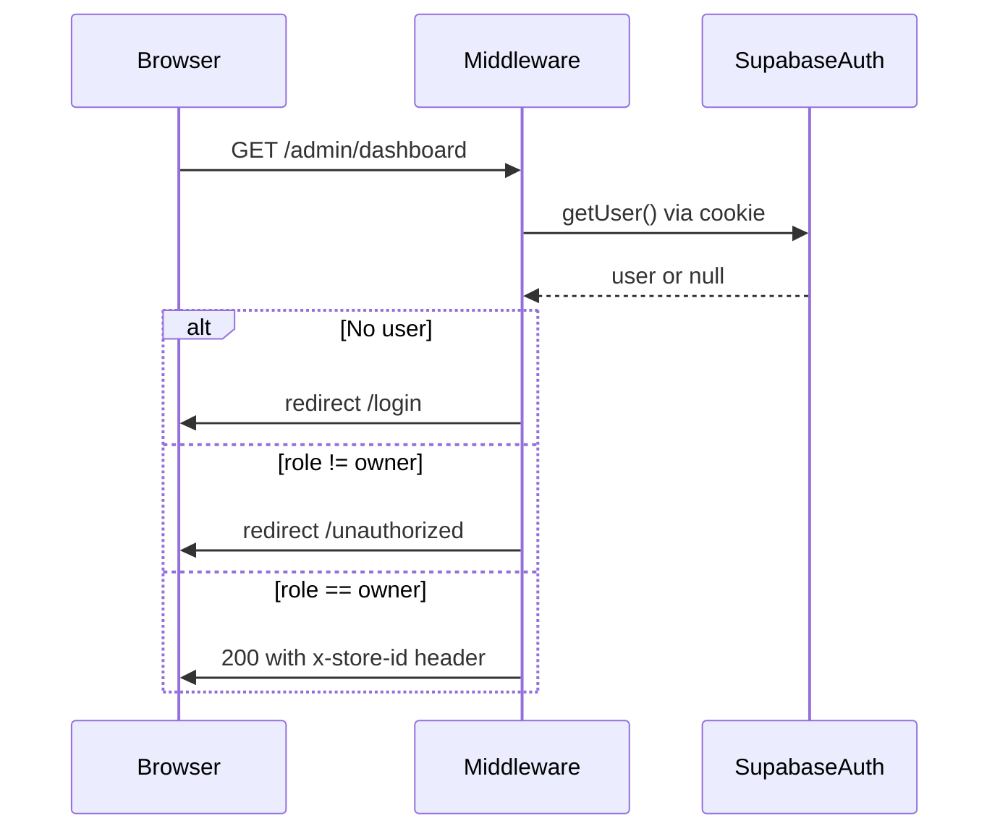
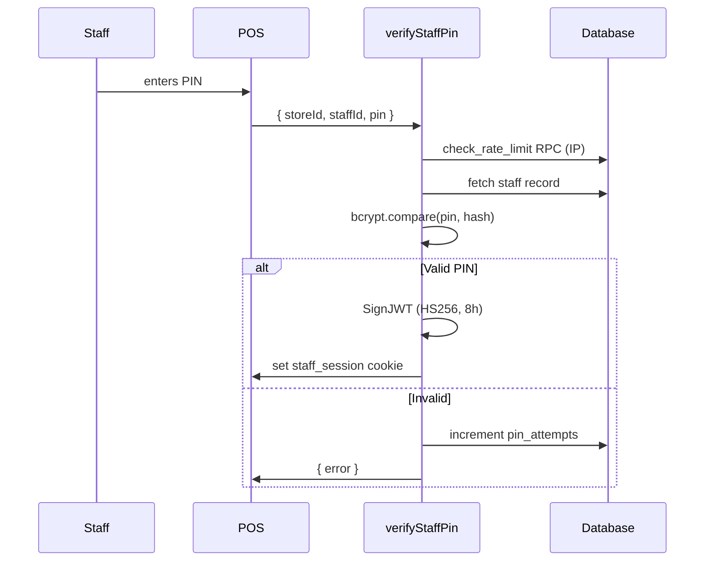
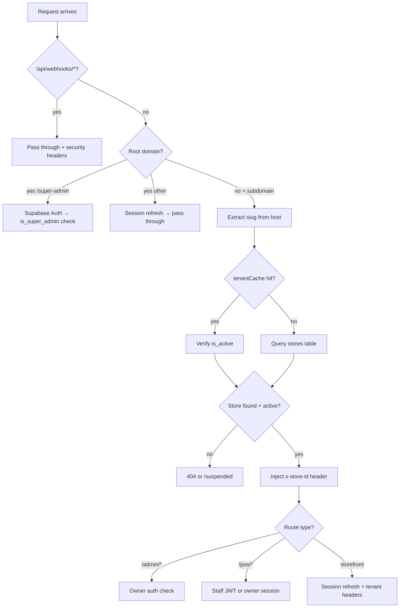

# Phase 19: Developer Documentation - Research

**Researched:** 2026-04-04
**Domain:** Technical documentation authoring — Markdown, Mermaid diagrams, developer setup guides, architecture docs, API inventories
**Confidence:** HIGH

## Summary

Phase 19 is a documentation-only phase. No application code changes. The deliverable is a `docs/` folder containing four Markdown files that comprehensively describe setup, architecture, environment variables, and all 48 Server Actions. All source material exists in the codebase; this phase is a writing and organization task, not a technical investigation task.

The codebase is well-structured and already well-commented from Phase 18 (JSDoc on all lib exports). The `supabase/seed.ts` file already exists. The `.env.example` was audited in Phase 17. Server Actions are consistently organized in `src/actions/{domain}/` subdirectories. The research risk is minimal — the challenge is accurate transcription and clear presentation, not discovery.

**Primary recommendation:** Write docs as direct reading of existing source files. Every claim in the docs must be verifiable against a specific file. No speculative or aspirational documentation.

<user_constraints>
## User Constraints (from CONTEXT.md)

### Locked Decisions

- **D-01:** All developer docs live in a `docs/` folder at the repo root. Separate from source code.
- **D-02:** Flat file structure with an index: `docs/README.md` (table of contents), `docs/setup.md`, `docs/architecture.md`, `docs/env-vars.md`, `docs/server-actions.md`.
- **D-03:** Use Mermaid diagrams for visual flows (auth, tenant routing, data flows). Renders natively on GitHub.
- **D-04:** Auth systems documented with Mermaid sequence diagrams per auth type (owner, staff PIN, customer, super admin) plus key file references (middleware.ts, resolveAuth.ts, jose). Enough to debug auth issues, not step-by-step code walkthroughs.
- **D-05:** Full end-to-end multi-tenant request lifecycle documented: request → middleware → subdomain extraction → tenant cache → RLS via custom JWT claims → response.
- **D-06:** Feature gating dual-path (requireFeature → free vs paid) AND billing/subscription data flow (Stripe webhook lifecycle, add-on subscription model) both included.
- **D-07:** Actions grouped by domain: Auth (~12), Orders (~6), Products (~5), Categories (~4), Billing (~2), Super Admin (~4), Setup (~5), Xero (~3), Promos (~2), Cash Sessions (~2). One table per group.
- **D-08:** Four columns per action: Name, Auth requirement (owner/staff/customer/super-admin/public), Zod input schema summary, one-line description. No response shape column — keeps maintenance low.
- **D-09:** Both Supabase setup paths documented: local Supabase CLI (`supabase start`) AND remote Supabase project. Local is primary, remote as alternative.
- **D-10:** Include a seed script that creates a demo store with sample products, categories, and a test user. Developer sees a working app immediately after setup. (Seed script already exists at `supabase/seed.ts`.)
- **D-11:** Stripe CLI setup included with `stripe listen --forward-to` for both order and billing webhook endpoints. Essential for testing checkout and subscription flows locally.
- **D-12:** Common gotchas/troubleshooting section covering: RLS blocking queries, missing env vars, subdomain routing on localhost (lvh.me), Supabase migration issues.

### Claude's Discretion

- Claude determines the exact Mermaid diagram structure and level of detail per diagram
- Claude determines the seed script implementation (SQL vs TypeScript, data volume) — already determined: TypeScript at `supabase/seed.ts`
- Claude determines the env var table format and grouping within `docs/env-vars.md`
- Claude determines whether additional docs files are needed beyond the four core files

### Deferred Ideas (OUT OF SCOPE)

None — discussion stayed within phase scope.
</user_constraints>

<phase_requirements>
## Phase Requirements

| ID | Description | Research Support |
|----|-------------|------------------|
| DOC-01 | Local development setup guide (clone to running app in under 20 minutes) | Seed script exists at `supabase/seed.ts`. Supabase CLI config at `supabase/config.toml`. Scripts: `npm run dev`. Stripe CLI needed for webhooks. lvh.me used for local subdomain routing. |
| DOC-02 | Environment variable reference table (name, purpose, source, required/optional) | `.env.example` is the source of truth — audited Phase 17 (SEC-09). 22 env vars total, grouped into 9 functional groups. |
| DOC-03 | Architecture overview document (auth systems, tenant isolation, feature gating, data flows) | Source files: `src/middleware.ts`, `src/lib/resolveAuth.ts`, `src/lib/tenantCache.ts`, `src/lib/requireFeature.ts`, `src/config/addons.ts`. All JSDoc-documented from Phase 18. |
| DOC-04 | Server Action inventory (all actions: name, input schema, auth requirement, description) | 48 actions across 10 domains in `src/actions/`. All follow consistent pattern: `'use server'` → `server-only` → Zod → auth check → DB → `{ success, error?, data? }`. |
</phase_requirements>

## Standard Stack

This phase produces Markdown files only. No new packages are installed.

### Core
| Library | Version | Purpose | Why Standard |
|---------|---------|---------|--------------|
| Markdown | N/A | Document format | GitHub renders natively, no build step |
| Mermaid | N/A | Diagrams as code | GitHub renders Mermaid natively in Markdown since 2022; no external tool needed |

### Existing Project Stack (reference only)
| Technology | Version | Purpose |
|------------|---------|---------|
| Next.js | 16.2.1 | Framework |
| React | 19.2.4 | UI |
| TypeScript | 5.x | Type safety |
| Supabase | @supabase/supabase-js ^2.x | DB + Auth |
| @supabase/ssr | ^0.10.0 | App Router adapter |
| Stripe | ^21.0.1 | Payments |
| Tailwind CSS | 4.x | Styling |
| Zod | ^4.3.6 | Validation |
| jose | ^6.2.2 | Staff PIN JWT |
| Vitest | ^2.x | Unit testing |
| Playwright | latest | E2E testing |

**Installation:** None required for this phase.

## Architecture Patterns

### Confirmed File Layout (D-01, D-02)
```
docs/
├── README.md         # Table of contents + quick links
├── setup.md          # Clone-to-running guide (DOC-01)
├── env-vars.md       # Environment variable reference (DOC-02)
├── architecture.md   # Auth, tenant isolation, feature gating (DOC-03)
└── server-actions.md # Full 48-action inventory (DOC-04)
```

### Multi-Tenant Request Lifecycle (for docs/architecture.md)

Verified by reading `src/middleware.ts` in full:

```
Request arrives
  ↓
/api/webhooks/* ? → skip auth, add security headers, pass through
  ↓
Extract host header → compare with ROOT_DOMAIN env var
  ↓
Root domain?
  ├── /super-admin/* → Supabase Auth → is_super_admin check → pass or redirect
  └── other root routes → session refresh, pass through
  ↓
Subdomain detected → extract slug (e.g. "mystore" from mystore.lvh.me:3000)
  ↓
tenantCache.getCachedStoreId(slug)
  ├── Cache hit → verify store.is_active (DB check, suspension enforcement)
  └── Cache miss → query stores table by slug → setCachedStoreId
  ↓
Unknown subdomain → 404
Suspended store → rewrite to /suspended
  ↓
Inject x-store-id, x-store-slug headers
  ↓
/admin/* → Supabase Auth → email verified? → role === 'owner'? → setup wizard?
/pos/login → pass through with tenant headers
/pos/* → staff JWT cookie OR owner Supabase session → or redirect to /pos/login
/* (storefront) → session refresh, pass through with tenant headers
  ↓
Security headers added to all responses
```

### Auth Systems (for docs/architecture.md)

**Three auth systems operate concurrently** — verified by reading `src/lib/resolveAuth.ts` and `src/middleware.ts`:

**1. Owner Auth (Supabase Auth)**
- Email/password login via Supabase Auth
- JWT stored in cookies via @supabase/ssr
- `app_metadata.role = 'owner'` and `app_metadata.store_id` set by `provisionStore` action
- Verified in middleware for /admin routes and POS fallback
- `resolveAuth()` checks owner session first, then staff JWT

**2. Staff PIN Auth (Custom JWT)**
- PIN verified against bcrypt hash in `staff` table
- Rate limited via `check_rate_limit` RPC (20 attempts/5 min IP-level, 10 attempts/5 min account-level)
- JWT issued via `jose` SignJWT with STAFF_JWT_SECRET (HS256, 8h expiry)
- Stored in HttpOnly `staff_session` cookie
- Verified in middleware via `jwtVerify(staffToken, staffSecret)`
- `resolveStaffAuth()` extracts from cookie, verifies, returns `{ store_id, staff_id, role }`

**3. Customer Auth (Supabase Auth)**
- Email/password via Supabase Auth
- `app_metadata.role = 'customer'`
- Blocked from /admin and /pos routes in middleware (silent redirect to /)
- RLS allows customer access to storefront-specific tables only

**4. Super Admin (Supabase Auth + metadata flag)**
- Regular Supabase Auth user with `app_metadata.is_super_admin = true`
- Checked at root domain /super-admin/* routes in middleware
- Cross-tenant; no store_id requirement
- `resolveAuth()` in actions uses separate super-admin check

### Tenant Isolation Model (for docs/architecture.md)

Verified by reading source files:

1. **Subdomain → store_id**: Middleware extracts slug from host, looks up `stores` table, injects `x-store-id` header
2. **tenantCache**: In-memory Map with 5-minute TTL per slug. Per-instance on Vercel serverless (cold starts hit DB; acceptable)
3. **Custom JWT claims**: `app_metadata.store_id` on owner JWT; Supabase auth hook (migration 003) sets custom claims on the token for RLS to use
4. **RLS policies**: All tables filter by `store_id`. Server Actions use admin client (service role) for mutations, relying on application-layer auth check rather than RLS for mutations
5. **SECURITY DEFINER RPCs**: `complete_pos_sale`, `complete_online_sale`, `increment_promo_uses`, `restore_stock`, `check_rate_limit` restricted to service_role via REVOKE/GRANT (migration 021)

### Feature Gating (for docs/architecture.md)

Verified by reading `src/lib/requireFeature.ts` and `src/config/addons.ts`:

- Three add-ons: `xero`, `email_notifications`, `custom_domain`
- **Fast path**: Read from `user.app_metadata[feature]` (JWT claim) — no DB round-trip
- **DB fallback**: Query `store_plans` table when `requireDbCheck: true` — used for critical mutations
- **Never throws** — returns `{ authorized: true }` or `{ authorized: false, feature, upgradeUrl }`
- `upgradeUrl` pattern: `/admin/billing?upgrade={feature}`

### Stripe Billing Webhook Lifecycle (for docs/architecture.md)

From `src/app/api/webhooks/stripe/billing/route.ts` and `STATE.md`:
- Separate webhook secret `STRIPE_BILLING_WEBHOOK_SECRET` (not shared with order webhook)
- Subscription events update `store_plans` boolean columns (`has_xero`, `has_email_notifications`, `has_custom_domain`)
- Per-add-on subscription model — no plan tiers, no upgrade cliffs

### Server Action Pattern (for docs/server-actions.md)

All 48 actions follow this consistent pattern (verified by reading multiple action files):

```typescript
'use server'           // must be first
import 'server-only'   // prevents accidental client bundling
// ... imports

export async function actionName(input: unknown) {
  // 1. Auth check (resolveAuth / resolveStaffAuth / supabase.auth.getUser)
  const auth = await resolveAuth()
  if (!auth) return { success: false, error: 'Not authenticated' }

  // 2. Zod validation
  const parsed = SomeSchema.safeParse(input)
  if (!parsed.success) return { success: false, error: 'Invalid input' }

  // 3. DB operation (admin client for mutations)
  const supabase = createSupabaseAdminClient()
  // ...

  // 4. Return { success, error?, data? }
  return { success: true, data: result }
}
```

## Complete Server Action Inventory (for docs/server-actions.md)

Verified by reading all files in `src/actions/`. Exact count: **48 actions** across 10 domains.

### Auth Domain (~14 actions across 3 auth-related patterns)
| File | Action Name | Auth Requirement | Description |
|------|------------|-----------------|-------------|
| `ownerSignup.ts` | `ownerSignup` | public | Creates Supabase Auth user (owner), triggers provisioning |
| `ownerSignin.ts` | `ownerSignin` | public | Signs in owner via Supabase Auth |
| `signOut.ts` | `signOut` | owner | Signs out owner Supabase session |
| `changePassword.ts` | `changePassword` | owner | Updates owner password via Supabase Auth |
| `updateEmail.ts` | `updateEmail` | owner | Updates owner email via Supabase Auth |
| `updateProfile.ts` | `updateProfile` | owner | Updates owner display name |
| `resetPassword.ts` | `resetPassword` | public | Sends password reset email |
| `resendVerification.ts` | `resendVerification` | public | Resends email verification |
| `provisionStore.ts` | `provisionStore` | public (called post-signup) | Creates store, staff record, sets JWT claims |
| `retryProvisioning.ts` | `retryProvisioning` | public | Retries failed provision_store RPC |
| `checkSlugAvailability.ts` | `checkSlugAvailability` | public | Checks if store slug is available |
| `staffPin.ts` | `verifyStaffPin` | public | Verifies staff PIN, issues 8h JWT, stores in HttpOnly cookie |
| `customerSignup.ts` | `customerSignup` | public | Registers customer Supabase Auth account |
| `customerSignin.ts` | `customerSignin` | public | Signs in customer |
| `customerSignOut.ts` | `customerSignOut` | customer | Signs out customer session |

### Orders Domain (6 actions)
| File | Action Name | Auth Requirement | Description |
|------|------------|-----------------|-------------|
| `completeSale.ts` | `completeSale` | staff/owner JWT | Completes POS sale: validates cart, decrements stock via complete_pos_sale RPC, creates order record |
| `createCheckoutSession.ts` | `createCheckoutSession` | public | Creates Stripe Checkout session for online storefront orders |
| `processRefund.ts` | `processRefund` | owner | Full refund via Stripe refund API + restores stock |
| `processPartialRefund.ts` | `processPartialRefund` | owner | Partial refund via Stripe + partial stock restore |
| `updateOrderStatus.ts` | `updateOrderStatus` | owner | Updates order status (confirmed/ready/completed/cancelled) |
| `sendPosReceipt.ts` | `sendPosReceipt` | staff/owner | Sends POS receipt email via Resend |

### Products Domain (5 actions)
| File | Action Name | Auth Requirement | Description |
|------|------------|-----------------|-------------|
| `createProduct.ts` | `createProduct` | owner | Creates product with GST-inclusive price, image upload to Supabase Storage |
| `updateProduct.ts` | `updateProduct` | owner | Updates product details and/or image |
| `deactivateProduct.ts` | `deactivateProduct` | owner | Soft-deletes product (sets is_active=false) |
| `importProducts.ts` | `importProducts` | owner | Bulk imports products from CSV |
| `lookupBarcode.ts` | `lookupBarcode` | staff/owner | Looks up product by barcode for POS scanner |

### Categories Domain (4 actions)
| File | Action Name | Auth Requirement | Description |
|------|------------|-----------------|-------------|
| `createCategory.ts` | `createCategory` | owner | Creates product category |
| `updateCategory.ts` | `updateCategory` | owner | Updates category name |
| `deleteCategory.ts` | `deleteCategory` | owner | Deletes category (unlinks products) |
| `reorderCategories.ts` | `reorderCategories` | owner | Updates display order of categories |

### Billing Domain (2 actions)
| File | Action Name | Auth Requirement | Description |
|------|------------|-----------------|-------------|
| `createSubscriptionCheckoutSession.ts` | `createSubscriptionCheckoutSession` | owner | Creates Stripe Checkout for add-on subscription |
| `createBillingPortalSession.ts` | `createBillingPortalSession` | owner | Creates Stripe Billing Portal session for self-service |

### Super Admin Domain (4 actions)
| File | Action Name | Auth Requirement | Description |
|------|------------|-----------------|-------------|
| `suspendTenant.ts` | `suspendTenant` | super-admin | Sets store.is_active=false, blocking all subdomain access |
| `unsuspendTenant.ts` | `unsuspendTenant` | super-admin | Sets store.is_active=true |
| `activateAddon.ts` | `activateAddon` | super-admin | Enables a billing add-on feature flag for a store |
| `deactivateAddon.ts` | `deactivateAddon` | super-admin | Disables a billing add-on feature flag |

### Setup Domain (5 actions)
| File | Action Name | Auth Requirement | Description |
|------|------------|-----------------|-------------|
| `saveStoreNameStep.ts` | `saveStoreNameStep` | owner | Wizard step: saves store name |
| `saveLogoStep.ts` | `saveLogoStep` | owner | Wizard step: uploads logo to Supabase Storage |
| `saveProductStep.ts` | `saveProductStep` | owner | Wizard step: creates first product |
| `dismissWizard.ts` | `dismissWizard` | owner | Marks setup_wizard_dismissed=true on store |
| `updateBranding.ts` | `updateBranding` | owner | Updates store branding (colors, logo) post-wizard |

### Xero Domain (3 actions)
| File | Action Name | Auth Requirement | Description |
|------|------------|-----------------|-------------|
| `triggerManualSync.ts` | `triggerManualSync` | owner | Manually triggers Xero accounting sync (requires xero add-on) |
| `saveXeroSettings.ts` | `saveXeroSettings` | owner | Saves Xero account code mappings |
| `disconnectXero.ts` | `disconnectXero` | owner | Disconnects Xero OAuth connection |

### Promos Domain (2 actions)
| File | Action Name | Auth Requirement | Description |
|------|------------|-----------------|-------------|
| `createPromoCode.ts` | `createPromoCode` | owner | Creates promotional discount code |
| `validatePromoCode.ts` | `validatePromoCode` | public | Validates promo code at checkout (storefront) |

### Cash Sessions Domain (2 actions)
| File | Action Name | Auth Requirement | Description |
|------|------------|-----------------|-------------|
| `openCashSession.ts` | `openCashSession` | staff/owner | Opens cash drawer session with opening float |
| `closeCashSession.ts` | `closeCashSession` | staff/owner | Closes cash session with closing count |

**Total: 15 + 6 + 5 + 4 + 2 + 4 + 5 + 3 + 2 + 2 = 48 actions** (matches SEC-08 count)

## Environment Variable Reference (for docs/env-vars.md)

Verified by reading `.env.example` (audited Phase 17, SEC-09):

| Variable | Purpose | Source | Required |
|----------|---------|--------|----------|
| `NEXT_PUBLIC_SUPABASE_URL` | Supabase project URL | Supabase dashboard → Settings → API | Yes |
| `NEXT_PUBLIC_SUPABASE_ANON_KEY` | Supabase anonymous key (public) | Supabase dashboard → Settings → API | Yes |
| `SUPABASE_SERVICE_ROLE_KEY` | Supabase service role key (server-only) | Supabase dashboard → Settings → API | Yes |
| `STORE_ID` | Legacy single-store UUID reference | After first store provisioned | Yes (legacy) |
| `NEXT_PUBLIC_STORE_ID` | Public store UUID for client components | Same as STORE_ID | Yes (legacy) |
| `NEXT_PUBLIC_BASE_URL` | App base URL | Set to app domain or `http://localhost:3000` | Yes |
| `NEXT_PUBLIC_SITE_URL` | Marketing site URL | Set to app domain | Yes |
| `NEXT_PUBLIC_ROOT_DOMAIN` | Root domain for client-side subdomain routing | `lvh.me:3000` (local) or `nzpos.co.nz` (prod) | Yes |
| `ROOT_DOMAIN` | Root domain for middleware subdomain routing (server) | Same as above without NEXT_PUBLIC_ | Yes |
| `STAFF_JWT_SECRET` | Secret for signing/verifying staff PIN JWTs | Generate with `openssl rand -base64 32` | Yes |
| `STRIPE_SECRET_KEY` | Stripe secret key for server-side API | Stripe dashboard → Developers → API keys | Yes |
| `NEXT_PUBLIC_STRIPE_PUBLISHABLE_KEY` | Stripe publishable key for client | Stripe dashboard → Developers → API keys | Yes |
| `STRIPE_WEBHOOK_SECRET` | Webhook signing secret for order webhook | `stripe listen` output or Stripe dashboard | Yes |
| `STRIPE_BILLING_WEBHOOK_SECRET` | Webhook signing secret for billing webhook | Separate webhook endpoint in Stripe dashboard | Yes |
| `STRIPE_PRICE_XERO` | Stripe Price ID for Xero add-on subscription | Stripe dashboard → Products | Yes |
| `STRIPE_PRICE_EMAIL_NOTIFICATIONS` | Stripe Price ID for email notifications add-on | Stripe dashboard → Products | Yes |
| `STRIPE_PRICE_CUSTOM_DOMAIN` | Stripe Price ID for custom domain add-on | Stripe dashboard → Products | Yes |
| `RESEND_API_KEY` | Resend API key for transactional email | resend.com → API Keys | Yes |
| `RESEND_FROM_ADDRESS` | From address for outbound emails | Verified domain in Resend | Yes |
| `XERO_CLIENT_ID` | Xero OAuth 2.0 client ID | Xero developer portal | Yes (for Xero add-on) |
| `XERO_CLIENT_SECRET` | Xero OAuth 2.0 client secret | Xero developer portal | Yes (for Xero add-on) |
| `XERO_REDIRECT_URI` | OAuth callback URL | Must match Xero app config | Yes (for Xero add-on) |
| `CRON_SECRET` | Bearer token for authenticating cron job routes | Generate with `openssl rand -base64 32` | Yes |
| `FOUNDER_EMAIL` | Notification destination for system alerts | Owner's email address | Yes |

**Total: 24 variables** across 9 functional groups (Supabase, Store identity, URLs, Staff auth, Stripe, Stripe billing, Email, Xero, Cron/Notifications).

## Don't Hand-Roll

| Problem | Don't Build | Use Instead | Why |
|---------|-------------|-------------|-----|
| Mermaid diagrams | Image exports, draw.io | Mermaid code blocks in Markdown | GitHub renders natively, version-controllable |
| Env var documentation | Manual free-text | Table derived from `.env.example` | Single source of truth already audited (SEC-09) |
| Action discovery | Manual grep | Read files in `src/actions/` systematically | Files are the ground truth; grep can miss re-exports |
| Seed data | New SQL migration | Extend existing `supabase/seed.ts` | TypeScript seed already handles auth user + store creation |

## Common Pitfalls

### Pitfall 1: Documentation Drift on Action Count
**What goes wrong:** Doc says "48 actions" but future phases add actions without updating `docs/server-actions.md`.
**Why it happens:** Docs live separate from code; no automated sync.
**How to avoid:** Note in `docs/server-actions.md` that it reflects state as of Phase 19. Include a grep command developers can run to recount: `find src/actions -name "*.ts" ! -name "*.test.ts" ! -name "__tests__" -type f | wc -l`.
**Warning signs:** Action files added in `src/actions/` without a corresponding docs update.

### Pitfall 2: lvh.me Subdomain Routing on Localhost
**What goes wrong:** Developer tries `localhost:3000` and gets root domain behavior — no store-tenant context.
**Why it happens:** Middleware checks `host` header; `localhost` is treated as root domain, not a subdomain.
**How to avoid:** Document explicitly: use `{slug}.lvh.me:3000` (e.g. `mystore.lvh.me:3000`) for tenant-scoped routes. `lvh.me` is a public wildcard DNS that resolves all subdomains to 127.0.0.1.
**Warning signs:** 404 on /admin, POS routes not loading, store not resolving.

### Pitfall 3: RLS Blocking Queries in Development
**What goes wrong:** Admin actions fail with "permission denied" errors during development.
**Why it happens:** Using anon client instead of service role client for mutations. Server Actions use `createSupabaseAdminClient()` (service role) deliberately.
**How to avoid:** Confirm `SUPABASE_SERVICE_ROLE_KEY` is set in `.env.local`. Don't mix up which env var powers which client.

### Pitfall 4: Supabase db reset Wipes Seed Data
**What goes wrong:** `supabase db reset` re-runs migrations and the seed, but if the seed is not re-run explicitly, the developer has an empty database.
**Why it happens:** `supabase db reset` runs `supabase/seed.sql` if it exists (not `.ts`). The project uses `supabase/seed.ts`.
**How to avoid:** Document the full reset workflow: `supabase db reset && npx tsx supabase/seed.ts`.

### Pitfall 5: Stripe Webhook Endpoints — Two Separate Secrets
**What goes wrong:** Developer forwards only one webhook endpoint and wonders why billing events don't fire.
**Why it happens:** The app has two webhook handlers at different paths: `/api/webhooks/stripe` (orders) and `/api/webhooks/stripe/billing` (subscriptions). Each requires its own signing secret.
**How to avoid:** Document both `stripe listen` commands or a single forwarding command that covers both paths.

### Pitfall 6: JWT Claims Not Updated After Provisioning
**What goes wrong:** Owner logs in but /admin routes redirect to unauthorized because `app_metadata.role` is absent from the JWT.
**Why it happens:** Supabase JWTs are cached; after `provisionStore` sets `role` and `store_id` in `app_metadata`, the JWT needs a refresh.
**How to avoid:** Document the middleware's token refresh logic (it calls `supabase.auth.refreshSession()` when `role` is missing). This is handled automatically on first /admin visit but may require a manual refresh in edge cases.

## Code Examples

### Mermaid Sequence Diagram — Owner Auth Flow
```markdown

```

### Mermaid Sequence Diagram — Staff PIN Auth Flow
```markdown

```

### Mermaid Flowchart — Multi-Tenant Request Routing
```markdown

```

## State of the Art

| Old Approach | Current Approach | When Changed | Impact |
|--------------|------------------|--------------|--------|
| draw.io/Lucidchart for diagrams | Mermaid in Markdown | GitHub Mermaid support 2022 | Diagrams version-controlled, no export workflow |
| README.md at repo root for all docs | Dedicated `docs/` directory | Phase 19 decision | Keeps root clean, scalable to multiple doc files |
| Manual env var lists | `.env.example` as source of truth | Standard practice | Single source, grep-verifiable |

## Open Questions

1. **Seed script completeness for DOC-01**
   - What we know: `supabase/seed.ts` exists and creates owner user + store + staff member. Read first 30 lines.
   - What's unclear: Whether it includes sample products and categories (D-10 requires "demo store with sample products, categories").
   - Recommendation: Planner should include a task to read the full `supabase/seed.ts` and extend it if products/categories are missing.

2. **Action schema summaries for DOC-04**
   - What we know: All actions use Zod schemas, many defined in `src/schemas/` directory.
   - What's unclear: Exact Zod schema shape for each of the 48 actions without reading every schema file.
   - Recommendation: Implementation agent must read `src/schemas/` and relevant action files to write accurate schema summaries. This is the most time-consuming part of DOC-04.

3. **"20 minutes" target validation**
   - What we know: The setup steps are: clone, install deps, `supabase start`, copy `.env.example`, run seed, `npm run dev`.
   - What's unclear: Whether Supabase Docker image pull time (first run, can take 5-10 min) is included in the 20-minute target.
   - Recommendation: Note in `docs/setup.md` that first `supabase start` may take longer due to Docker image pull; subsequent starts are fast.

## Environment Availability

Step 2.6: This phase has no external runtime dependencies — it produces only Markdown files. The documentation references tools that developers will need (Supabase CLI, Stripe CLI, Docker), but those are documented, not required to write the docs.

| Dependency | Required By | Available | Version | Fallback |
|------------|------------|-----------|---------|----------|
| Supabase CLI | Referenced in `docs/setup.md` | Not checked (doc-only phase) | — | Note: required by readers, not author |
| Stripe CLI | Referenced in `docs/setup.md` | Not checked (doc-only phase) | — | Note: required by readers, not author |

**No dependencies block this phase.** The author needs only a text editor and the existing codebase.

## Validation Architecture

### Test Framework
| Property | Value |
|----------|-------|
| Framework | Vitest ^2.x |
| Config file | `vitest.config.mts` |
| Quick run command | `npm run test` |
| Full suite command | `npm run test:coverage` |

### Phase Requirements → Test Map

Documentation phases have no automated tests by nature. Validation is manual verification against success criteria.

| Req ID | Behavior | Test Type | Automated Command | File Exists? |
|--------|----------|-----------|-------------------|-------------|
| DOC-01 | Setup guide covers clone-to-running in ≤20 min with no undocumented steps | manual | — | ❌ Wave 0 (doc file) |
| DOC-02 | Every env var has name, purpose, source, required/optional | manual | — | ❌ Wave 0 (doc file) |
| DOC-03 | Architecture doc covers three auth systems, tenant isolation, feature gating, data flows | manual | — | ❌ Wave 0 (doc file) |
| DOC-04 | Server Action inventory covers all 48 actions with name, schema, auth, description | manual | Verify count: `find src/actions -name "*.ts" ! -path "*__tests__*" ! -name "*.test.ts" -type f \| wc -l` | ❌ Wave 0 (doc file) |

**Automated verification possible for DOC-04:** The 48-action count can be machine-verified. All other requirements require human reading.

### Sampling Rate
- **Per task commit:** Proofread the written file for accuracy against source
- **Per wave merge:** Full manual review of all docs files for internal consistency
- **Phase gate:** All four docs files complete and passing manual review before `/gsd:verify-work`

### Wave 0 Gaps

The four documentation files are themselves the Wave 0 output:
- [ ] `docs/README.md` — table of contents
- [ ] `docs/setup.md` — DOC-01
- [ ] `docs/env-vars.md` — DOC-02
- [ ] `docs/architecture.md` — DOC-03
- [ ] `docs/server-actions.md` — DOC-04

No test infrastructure gaps — this phase has no automated tests.

## Sources

### Primary (HIGH confidence)

- Direct source code reading: `src/middleware.ts` — multi-tenant routing, security headers, auth flows (confirmed current)
- Direct source code reading: `src/lib/resolveAuth.ts` — auth resolution pattern (confirmed current)
- Direct source code reading: `src/lib/requireFeature.ts` — feature gating dual-path (confirmed current)
- Direct source code reading: `src/lib/tenantCache.ts` — tenant cache TTL and API (confirmed current)
- Direct source code reading: `.env.example` — all 24 env vars (audited Phase 17 SEC-09, confirmed complete)
- Direct source code reading: `src/actions/` — all 48 Server Action files enumerated (find command verified count)
- Direct source code reading: `src/config/addons.ts` — three add-ons, feature flag mapping (confirmed current)
- Direct source code reading: `supabase/seed.ts` — seed script exists (confirmed, partial read)
- Direct source code reading: `supabase/migrations/` — 23 migration files (listed)
- Direct source code reading: `package.json` — dev scripts, actual installed package versions (confirmed)
- Direct source code reading: `vitest.config.mts` — test framework config and coverage thresholds (confirmed)
- `.planning/STATE.md` — accumulated architectural decisions from all phases (confirmed current)

### Secondary (MEDIUM confidence)

- GitHub Mermaid rendering: Mermaid in Markdown is natively rendered on GitHub (confirmed stable since 2022; no doc URL checked but widely known)

### Tertiary (LOW confidence)

None — all findings are from direct codebase inspection.

## Project Constraints (from CLAUDE.md)

Directives the planner must verify compliance with:

| Directive | Applies to Phase 19 |
|-----------|---------------------|
| Always read DESIGN.md before visual/UI decisions | Not applicable — no UI changes in this phase |
| No deviations from CLAUDE.md tech stack | Not applicable — no code written |
| GSD workflow enforcement (use Write tool for files) | YES — doc files must be created via Write tool, not bash heredoc |
| No Prisma, Redux, NextAuth, Clerk, Tailwind v3 | Not applicable — no deps added |
| Next.js App Router patterns | Not applicable — no app code |
| Zod validation on all Server Actions | Not applicable — no new actions |
| `server-only` on all files with secrets | Not applicable — no new server files |
| Supabase client via @supabase/ssr, not deprecated auth-helpers | Not applicable |
| GST 15% tax-inclusive, IRD-compliant | Not applicable — no pricing code |
| EFTPOS standalone terminal (no software integration) | Not applicable |

**Phase 19 is documentation-only. CLAUDE.md coding constraints do not apply to Markdown file content. The only binding constraint is D-01 through D-12 from CONTEXT.md.**

## Metadata

**Confidence breakdown:**
- Standard stack: HIGH — this phase writes Markdown files, no novel tech decisions
- Architecture: HIGH — verified by direct source code reading of all referenced files
- Server Action inventory: HIGH — enumerated all 48 files, patterns confirmed by reading multiple examples
- Env vars: HIGH — `.env.example` is the audited source of truth (SEC-09)
- Pitfalls: HIGH — derived from actual codebase decisions in STATE.md (lvh.me, dual webhook secrets, JWT refresh pattern)

**Research date:** 2026-04-04
**Valid until:** 2026-05-04 (stable docs domain; only invalidated if new phases add actions or env vars before Phase 19 executes)
