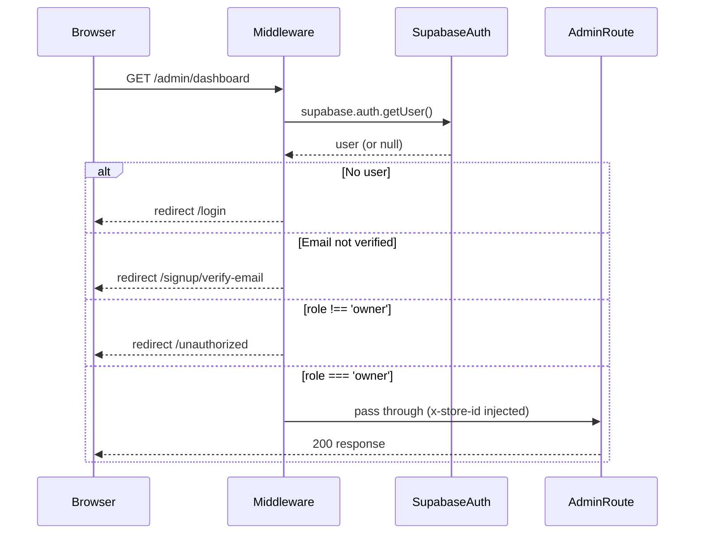
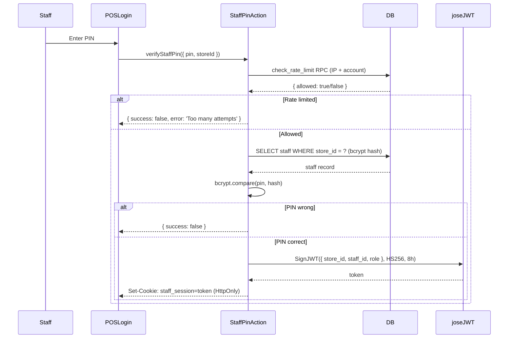
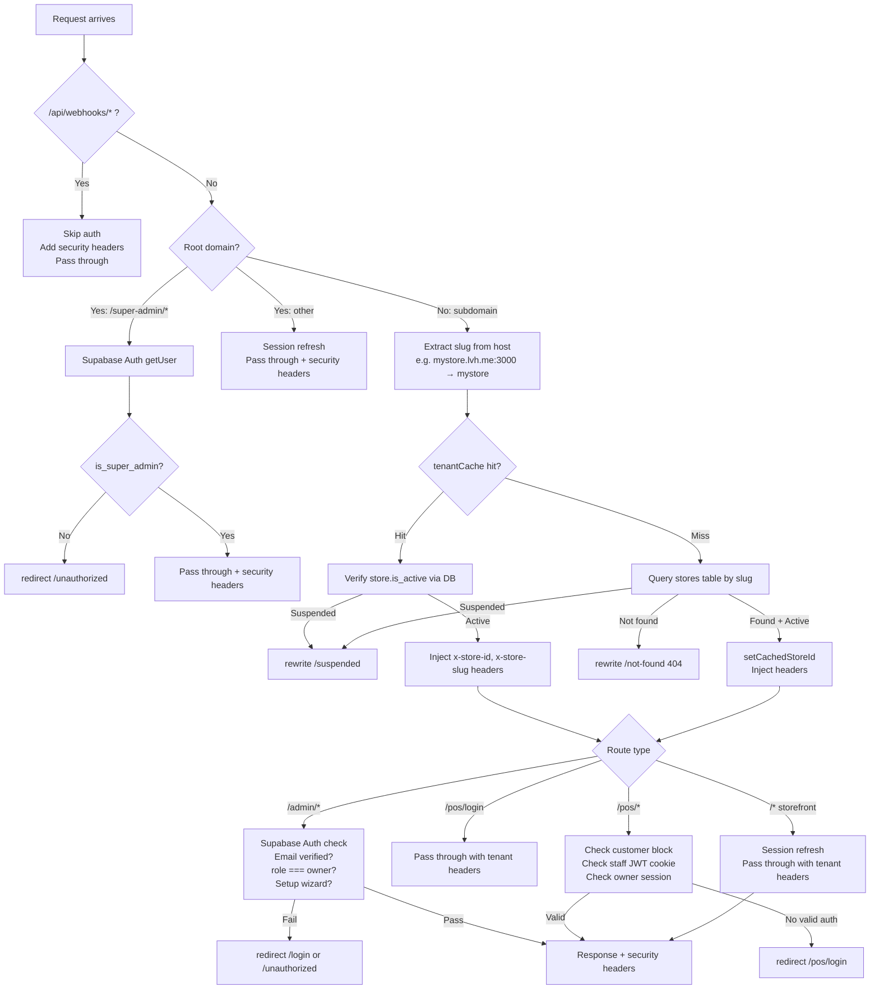
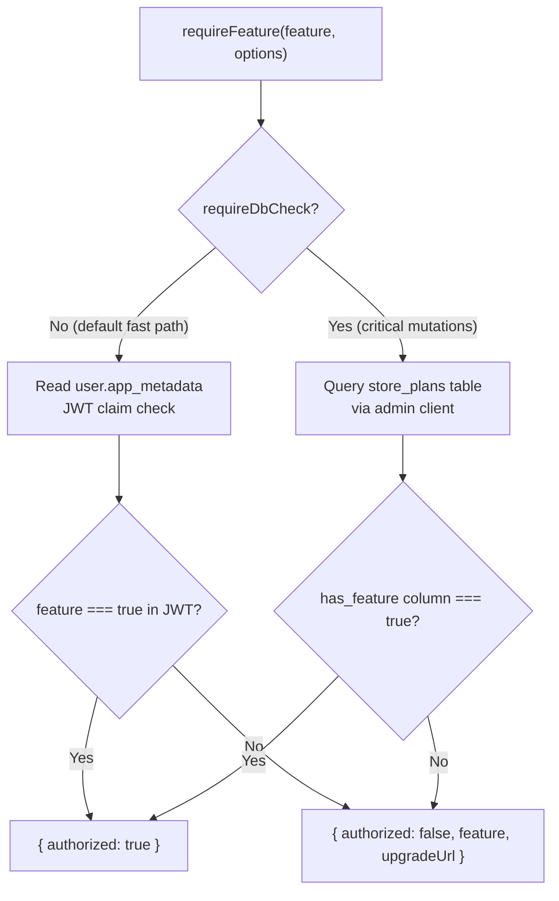
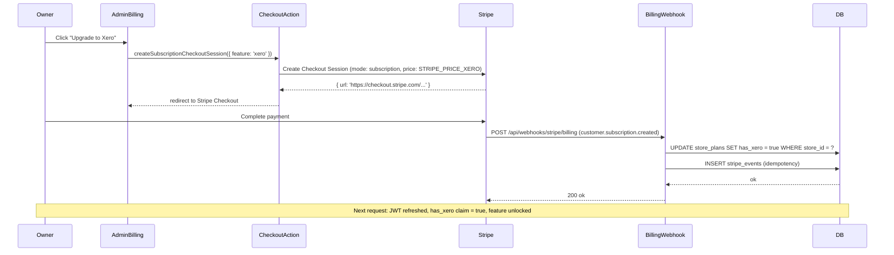

# Architecture Overview

NZPOS is a multi-tenant SaaS POS and online store. This document covers the key architectural patterns: authentication, tenant isolation, feature gating, and billing. It is written for a developer (or the founder returning after months) who needs to understand the system without reading source code line by line.

## Key Files

| File | Purpose |
|------|---------|
| `src/middleware.ts` | Entry point for all requests. Handles subdomain extraction, tenant resolution, route-level auth, and security headers. |
| `src/lib/resolveAuth.ts` | Action-layer auth helper. Resolves the caller as owner or staff from cookie/JWT. Returns `{ store_id, staff_id }` or `null`. |
| `src/lib/tenantCache.ts` | In-memory Map cache (5-min TTL) for slug-to-store_id lookups. Avoids a DB query on every request. |
| `src/lib/requireFeature.ts` | Feature gate guard. Checks JWT claim (fast path) or `store_plans` table (DB fallback). Never throws. |
| `src/config/addons.ts` | Centralised add-on config: feature names, Stripe Price IDs, and `store_plans` column mappings. |

---

## Authentication

Three authentication systems operate concurrently, plus a super admin overlay. Each system is independent — owner auth does not depend on staff auth, and vice versa.

### Owner Auth (Supabase Auth)

Owners sign in with email and password via Supabase Auth. The JWT is stored in cookies and managed by `@supabase/ssr`.

Key facts:
- `app_metadata.role = 'owner'` and `app_metadata.store_id` are set by the `provisionStore` action during signup.
- Middleware verifies the owner session for `/admin` routes using `supabase.auth.getUser()`.
- `resolveAuth()` in Server Actions checks the owner session first, then falls back to staff PIN JWT.
- Email must be verified before the owner can access `/admin` (middleware gate).
- Key files: `src/actions/auth/ownerSignin.ts`, `src/lib/resolveAuth.ts`, `src/lib/supabase/server.ts`



### Staff PIN Auth (Custom JWT)

Staff log in with a 4-digit PIN. This is entirely separate from Supabase Auth — it uses a custom JWT signed with `STAFF_JWT_SECRET`.

Key facts:
- PIN is verified against a bcrypt hash stored in the `staff` table.
- Rate limited via the `check_rate_limit` RPC: 20 attempts per 5 minutes at IP level, 10 per 5 minutes at account level.
- JWT is signed via `jose` SignJWT (HS256 algorithm, 8-hour expiry) and stored in an HttpOnly `staff_session` cookie.
- Middleware verifies the staff JWT via `jwtVerify(staffToken, staffSecret)`.
- `resolveStaffAuth()` extracts the JWT payload: `{ store_id, staff_id, role }`.
- Key files: `src/actions/auth/staffPin.ts`, `src/middleware.ts`, `src/lib/resolveAuth.ts`



### Customer Auth (Supabase Auth)

Customers sign in with email and password via Supabase Auth. Their sessions are store-scoped.

Key facts:
- `app_metadata.role = 'customer'` is set during customer signup.
- Customers are silently redirected to `/` if they attempt to access `/admin` or `/pos` routes (middleware gate).
- RLS policies limit customer access to storefront-relevant tables only.
- Key files: `src/actions/auth/customerSignin.ts`, `src/actions/auth/customerSignup.ts`

### Super Admin (Supabase Auth + metadata flag)

Super admins are platform operators — they can view and manage all tenants.

Key facts:
- A super admin is a regular Supabase Auth user with `app_metadata.is_super_admin = true`.
- This flag is set manually (Supabase Dashboard or migration) — there is no self-serve super admin signup.
- Super admin routes live at `/super-admin/*` on the **root domain** only (not tenant subdomains).
- `resolveAuth()` checks the `is_super_admin` flag before the staff/customer check — super admins have no `store_id` requirement.
- Key files: `src/middleware.ts`, `src/app/(root)/super-admin/`

---

## Multi-Tenant Request Lifecycle

Every request flows through `src/middleware.ts`. The full lifecycle:



### Step-by-Step Walkthrough

**Step 1: Webhook passthrough**
Routes matching `/api/webhooks/*` skip all auth and tenant resolution. They receive raw request bodies (required for Stripe signature verification) and get security headers only.

**Step 2: Root domain vs subdomain**
The middleware checks the `host` header against `ROOT_DOMAIN` env var (default: `lvh.me:3000` for local dev). `localhost` and `127.0.0.1` are also treated as root. Root domain serves the marketing site and super admin panel.

**Step 3: Subdomain extraction**
For tenant subdomains, the slug is extracted from the first segment of the host: `mystore.lvh.me:3000` → `mystore`.

**Step 4: Tenant cache lookup**
`tenantCache.getCachedStoreId(slug)` checks an in-memory Map. Cache entries expire after 5 minutes. On Vercel serverless, the cache is per-instance — cold starts hit the DB; warm instances benefit from the cache.

**Step 5: Cache miss / suspension check**
- Cache miss: query `stores` table by `slug`. Unknown slug → 404. Suspended → `/suspended` rewrite. Found + active → `setCachedStoreId(slug, storeId)`.
- Cache hit: still verifies `is_active` via a fast indexed DB lookup (added in Phase 16 to enforce suspension across cold-started instances).

**Step 6: Inject tenant headers**
`x-store-id` and `x-store-slug` are injected into request headers. Downstream Server Components and Server Actions read these to scope all queries.

**Step 7: Route-level auth**
- `/admin/*`: Supabase Auth owner session required. Email verified, `role === 'owner'`, and setup wizard not dismissed.
- `/pos/login`: Pass through (login page itself, no auth check).
- `/pos/*`: Staff JWT cookie (any valid `role: staff | owner`) OR owner Supabase session. Customers are blocked.
- `/*` (storefront): Public. Session is refreshed if present (to maintain cookie TTL).

**Step 8: Security headers**
`addSecurityHeaders()` wraps all response paths. Adds: `Content-Security-Policy-Report-Only`, `X-Content-Type-Options: nosniff`, `X-Frame-Options: DENY`, `Referrer-Policy: strict-origin-when-cross-origin`. CSP is report-only in v1 (monitoring before enforcing in production).

Key files: `src/middleware.ts`, `src/lib/tenantCache.ts`, `src/lib/supabase/middleware.ts`

---

## Tenant Isolation Model

Tenant isolation is enforced at five layers. Each layer is independently sufficient for correctness; multiple layers provide defence in depth.

| Layer | Mechanism | Where |
|-------|-----------|-------|
| 1. Subdomain → store_id | Middleware extracts slug, looks up store, injects `x-store-id` header | `src/middleware.ts` |
| 2. Tenant cache | In-memory Map per serverless instance, 5-min TTL | `src/lib/tenantCache.ts` |
| 3. Custom JWT claims | `app_metadata.store_id` on owner JWT; set by Supabase auth hook (migration 003) | Supabase auth hook |
| 4. RLS policies | All tables filter `WHERE store_id = auth.jwt()->>'store_id'` | Supabase DB migrations |
| 5. SECURITY DEFINER RPCs | `complete_pos_sale`, `complete_online_sale`, `increment_promo_uses`, `restore_stock`, `check_rate_limit` — restricted to `service_role` via `REVOKE`/`GRANT` (migration 021) | Supabase DB migrations |

**Important:** Server Actions use the admin client (service role) for mutations. Application-layer auth (`resolveAuth()`) provides the primary check. RLS provides a DB-level backstop for reads via the regular client.

---

## Feature Gating

Three paid add-ons are available: `xero`, `email_notifications`, `custom_domain`. These are checked via `requireFeature()` in `src/lib/requireFeature.ts`.

The add-on config lives in `src/config/addons.ts`:
- `PRICE_ID_MAP`: maps feature names to Stripe Price IDs (from env vars — never hardcoded)
- `PRICE_TO_FEATURE`: reverse map for webhook handlers (Price ID → `store_plans` column)
- `FEATURE_TO_COLUMN`: maps feature names to `store_plans` boolean columns (`has_xero`, `has_email_notifications`, `has_custom_domain`)

### Dual-Path Check



Key behaviours:
- **Fast path (default):** Reads `user.app_metadata[feature]` from the JWT — no DB round-trip. Used for UI rendering and non-critical actions.
- **DB fallback (`requireDbCheck: true`):** Queries `store_plans` directly. Used for critical mutations (e.g., triggering a Xero sync) where stale JWT claims are unacceptable.
- **Never throws.** Returns `{ authorized: true }` or `{ authorized: false, feature, upgradeUrl }`. Callers redirect to `upgradeUrl` (e.g., `/admin/billing?upgrade=xero`).

---

## Billing and Subscriptions

NZPOS uses a per-add-on subscription model — no plan tiers, no upgrade cliffs. Each add-on is a separate Stripe subscription.

### Add-On Subscription Flow



### Billing Webhook

- Endpoint: `POST /api/webhooks/stripe/billing`
- Signed with `STRIPE_BILLING_WEBHOOK_SECRET` (separate from the order webhook secret `STRIPE_WEBHOOK_SECRET`)
- Handles: `customer.subscription.created`, `customer.subscription.updated`, `customer.subscription.deleted`
- Idempotent: checks `stripe_events` table before processing; inserts event ID after processing (deduplication)
- Resolves `store_id` from `subscription.metadata.store_id` or by looking up `stores.stripe_customer_id`

### Billing Portal

Owners can manage subscriptions (cancel, update payment method) via the Stripe Billing Portal:
- Action: `createBillingPortalSession()`
- Stripe manages the portal UI; NZPOS never handles raw card data

Key files: `src/app/api/webhooks/stripe/billing/route.ts`, `src/config/addons.ts`, `src/lib/requireFeature.ts`

---

## Data Flow: POS Sale

A completed POS sale is an atomic database transaction executed via a `SECURITY DEFINER` RPC.

```
Staff selects items
  → Cart state (React client state)
  → completeSale Server Action
  → Zod validation (line items, payment method, amounts)
  → resolveAuth() — requires staff JWT or owner session
  → complete_pos_sale RPC (SECURITY DEFINER, service_role only)
    → Atomically: decrement stock, create order + line items, create cash session entry
  → { success: true, orderId }
  → Cart cleared, receipt displayed
```

Key properties:
- Stock decrement and order creation happen in a single DB transaction (no partial states)
- `complete_pos_sale` is restricted to `service_role` via `REVOKE`/`GRANT` — cannot be called directly by client code
- EFTPOS payments require a manual confirmation step (terminal approved? yes/no) before `completeSale` is called — prevents phantom sales

---

## Data Flow: Online Order

Online orders flow through Stripe Checkout (hosted page — NZPOS never handles raw card data).

```
Customer adds items to cart
  → createCheckoutSession Server Action
  → Stripe Checkout hosted page (Stripe manages PCI compliance)
  → Customer completes payment
  → Stripe sends webhook: POST /api/webhooks/stripe/orders (checkout.session.completed)
  → Webhook: complete_online_sale RPC (SECURITY DEFINER, service_role only)
    → Atomically: decrement stock, create order + line items, apply promo code if present
  → If email_notifications add-on active: send order confirmation email via Resend
  → Customer sees order confirmation page
```

Key properties:
- The webhook is the source of truth for order completion (not the Stripe redirect)
- Promo code redemption (`increment_promo_uses`) is an atomic RPC call restricted to `service_role`
- Stock overselling is prevented by the atomic RPC — concurrent orders for the same item will fail if stock reaches zero

---

## Security Model Summary

| Concern | Mechanism |
|---------|-----------|
| SQL injection | Supabase client parameterized queries throughout |
| XSS | CSP (report-only in v1), `X-Content-Type-Options: nosniff` |
| Clickjacking | `X-Frame-Options: DENY` |
| Auth bypass | `server-only` import in all Server Actions (prevents accidental client bundling) |
| Tenant data leak | RLS on all tables + `store_id` filter in all queries + x-store-id header |
| Staff PIN brute force | `check_rate_limit` RPC (20/5min IP, 10/5min account) |
| Stripe webhook spoofing | Signature verification via `stripe.webhooks.constructEvent()` |
| Privileged RPC abuse | `REVOKE EXECUTE` + `GRANT ... TO service_role` on SECURITY DEFINER RPCs |
| Token exposure | Xero OAuth tokens stored in Supabase Vault (SECURITY DEFINER RPCs, never in app memory) |
